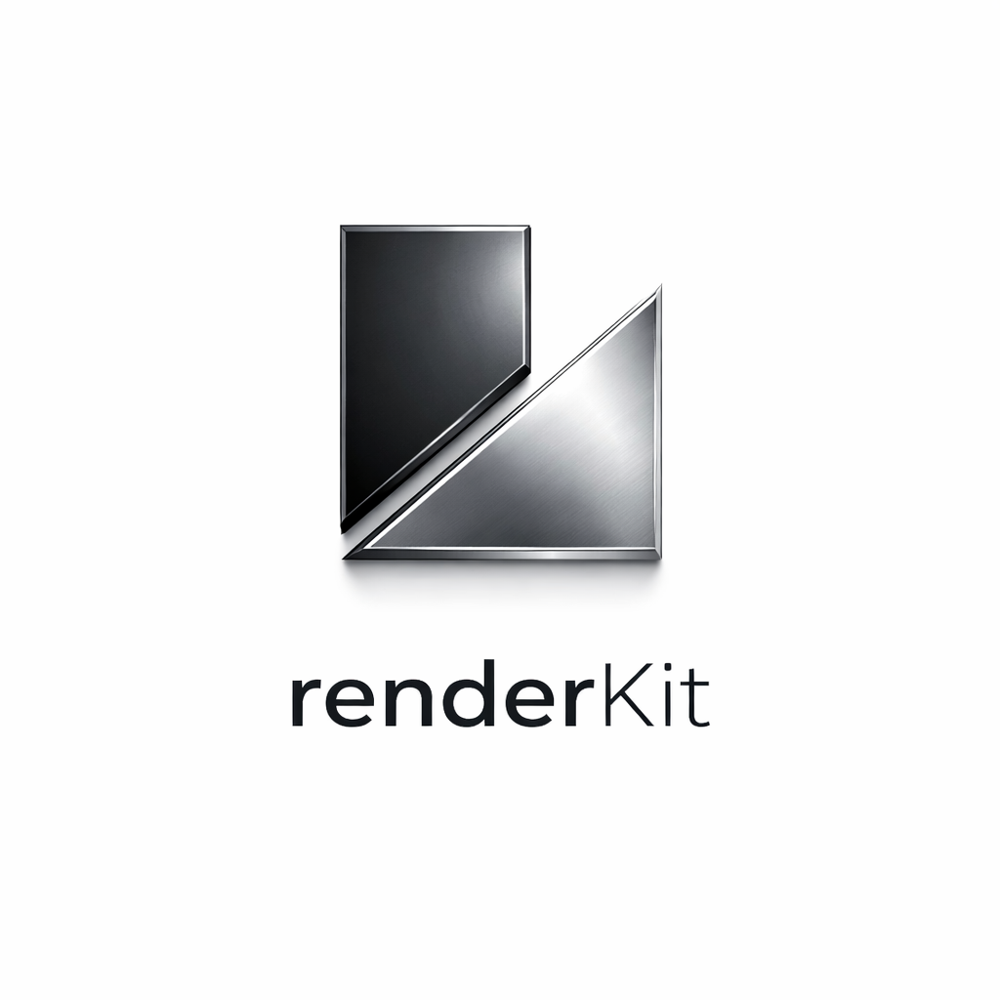

# renderKit

<p align="center">
  
</p>

RenderKit is a premium Gutenberg block system built with React, TypeScript, and Tailwind CSS. It focuses on beautiful, interactive blocks with a clean editor experience and reliable frontend rendering.

## Highlights

- React-based block UI with TypeScript safety
- Tailwind CSS styling pipeline
- WordPress-first build output in `build/`
- Designed for performant, interactive blocks

## Requirements

- WordPress 6.0+
- PHP 8.0+
- Node.js (for local development and builds)

## Quick start

1) Copy this folder to `wp-content/plugins/renderkit`
2) Activate "renderKit" in the WordPress admin

## Development

Install dependencies:

```bash
npm install
```

Run the build in watch mode:

```bash
npm run dev
```

Build production assets:

```bash
npm run build
npm run build:css
```

Type-check the project:

```bash
npm run typecheck
```

## Project layout

- `src/` — Block source code (React, TypeScript, styles)
- `build/` — Compiled block assets for WordPress
- `includes/` — PHP plugin classes
- `resources/` — Brand assets (logo)
- `renderkit.php` — Plugin bootstrap
